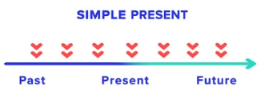
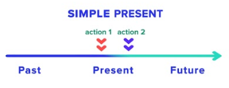

# Simple Present

## 1. Uses

### 1.1  Repeated actions ( always, every week, never, often, sometimes)

* My friend often draw**s** nice posters.
* I always watch the news on television.
* My father works five days a week.

### 1.2 Fixed arrangements, scheduled events

* The plane flies to London every Monday. *(Fixed arrangements)*

> When we talk about something which happends repeatedely.
> 

### 1.3 Sequence of actions in the present (first - then, after that)

* First I get up, them I have breakfast.

> To describe a series of actions in present
> 

### 1.4 Things in general

* The sun rise**s** in the east.
* My parents live**s** in London.
* I am at home
* Julia read**s** a book.
* I am happy

### 1.5 Instructions

* Open your books at page 34.

### 1.6 With special verbs 

Which are normally not used with the Present continuos.
These verbs express states, progressions, feelings, etc.

* I understand English.

  * be
  * believe
  * belong
  * hate
  * hear
  * like
  * love
  * mean
  * prefer
  * remain
  * realize
  * see
  * seem
  * smell
  * think
  * understand
  * want
  * wish

## 2. Signal words

* often
* always
* sometimes
* never
* usually
* frequently
* occasionally
* seldom
* never

* every day, every week, every year
* on Mondays, every Thursdays
* after school

Examples

* Sofia never arrives on time.
* Your friend always says very interesting thinfs
  
## 3. Form 

Infinitive 

> 3rd person singular 
> Infinitive + -s

| Finish                     | To do       | Example             |
| -------------------------- | ----------- | ------------------- |
| Vowel                      | + s         | play - play**s**    |
| Consonant + y              | ~~y~~ + ies | study - stud**ies** |
| --ss, -sh, -ch, -x, -z, -o | + es        | go - go**es**       |

  
## 4. Structure

### 4.1 Affirmative

| Subject          | Verb (-s) | Rest        |
| ---------------- | --------- | ----------- |
| I, you, we, they | play      | with a ball |
| he, she, it      | plays     | with a ball |

* Our teacher knows a lot.
* The news seems insteresting.
* John likes cats

### 4.2 Negative

| Subject          | Auxiliary | Verb | Rest        |
| ---------------- | --------- | ---- | ----------- |
| I, you, we, they | don't     | play | with a ball |
| he, she, it      | doesn't   | play | with a ball |

* She usually doesn't go to bed until midnight.

### 4.3 Question

| Auxiliary | Subject          | Verb | Rest      |
| --------- | ---------------- | ---- | --------- |
| Do        | I, you, we, they | read | books?    |
| Does      | he, she, it      | play | football? |

* Does your teacher give you too much homework ?
* Does Mathew play computer games at night ?
* Does the teacher checks your homework ?
* Do you wait at the train station ?

### 4.3 With Question Word

| Question Word | Auxiliary | Subject          | Verb | Rest |
| ------------- | --------- | ---------------- | ---- | ---- |
| What          | do        | I, you, we, they | play | ?    |
| Where         | does      | he, she, it      | live | ?    |

* How many hour a week does Benjamin work ?
* What do they talk about ?
* What does it mean ?
* Where does James come from ?

### 4.4 Verb To Be

#### Affirmative

| Subject       | To be | Rest         |
| ------------- | ----- | ------------ |
| I             | am    | from Britain |
| you           | are   | from Britain |
| he, she, it   | is    | from Britain |
| we, you, they | are   | from Britain |

* This knowledge is enough.
* They say money is power.
* She is funny.

#### Negative

| Subject       | To be | not | Rest         |
| ------------- | ----- | --- | ------------ |
| I             | am    | not | from Britain |
| you           | are   | not | from Britain |
| he, she, it   | is    | not | from Britain |
| we, you, they | are   | not | from Britain |

* Lindsay isn't German.
* We aren't American.

#### Questions

| To Be | Subject       | Rest           |
| ----- | ------------- | -------------- |
| Am    | I             | from Britain ? |
| Are   | you           | from Britain ? |
| Is    | he, she, it   | from Britain ? |
| Are   | we, you, they | from Britain ? |

* Is she an English teacher ?
* Is it cold outside ?

#### Questions Wh-

| Question Word | To Be | Subject       | Rest    |
| ------------- | ----- | ------------- | ------- |
| What          | Am    | I             | doing ? |
| Where         | Are   | you           | from  ? |
| Who           | Is    | he, she, it   | ?       |
| How           | Are   | we, you, they | ?       |

* Who is Emily with ?
* When do yo usually gi on holiday ?

### 4.5 Verb Do

#### Affirmative

| Subject       | Do   | Rest      |
| ------------- | ---- | --------- |
| I             | do   | exercises |
| you           | do   | exercises |
| he, she, it   | does | exercises |
| we, you, they | do   | exercises |

#### Negative

| Subject       | Auxiliary | not | Do  | Rest      |
| ------------- | --------- | --- | --- | --------- |
| I             | do        | not | do  | exercises |
| you           | do        | not | do  | exercises |
| he, she, it   | does      | not | do  | exercises |
| we, you, they | do        | not | do  | exercises |

#### Questions

| Auxiliary | Subject       | Do  | Rest        |
| --------- | ------------- | --- | ----------- |
| Do        | I             | do  | exercises ? |
| Do        | you           | do  | exercises ? |
| Does      | he, she, it   | do  | exercises ? |
| Do        | we, you, they | do  | exercises ? |

* Does your father do business?

### 4.5 Verb Have

#### Affirmative

| Subject       | Have | Rest  |
| ------------- | ---- | ----- |
| I             | have | books |
| you           | have | books |
| he, she, it   | has  | books |
| we, you, they | have | books |

* My son has a lot of toys.

#### Negative

| Subject       | Auxiliary | not | Have | Rest  |
| ------------- | --------- | --- | ---- | ----- |
| I             | do        | not | have | books |
| you           | do        | not | have | books |
| he, she, it   | does      | not | have | books |
| we, you, they | do        | not | have | books |

#### Questions

| Auxiliary | Subject       | Have | Rest    |
| --------- | ------------- | ---- | ------- |
| Do        | I             | have | books ? |
| Do        | you           | have | books ? |
| Does      | he, she, it   | have | books ? |
| Do        | we, you, they | have | books ? |

* Do your parents have a cup of tea in the morning ?